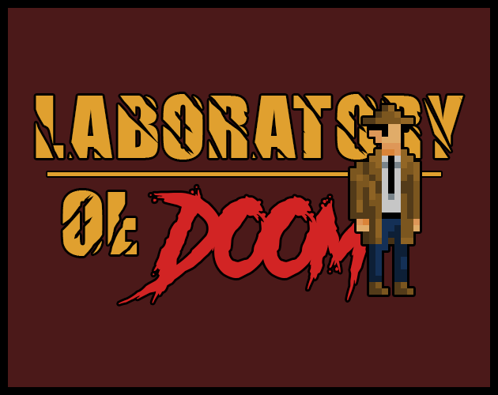

# LABORATORY OF DOOM (Original Jam Version)

  

## OVERVIEW
An entry for Ludum Dare 54 on Septemper 29th, 2023.  
__THEME: LIMITED SPACE__

Switch to the `post-jam` branch for the post-jam version of this game, which includes bonus content, additional features, and more polished/optimized gameplay.

## DESCRIPTION
You’re a __private detective__ who gets to investigate about an __unknown substance__ being experimented on humans that turned them into __atrocious monsters__. Because of the urge to find the truth behind all of this and bring it to the light, you went to an __abandoned laboratory__ in which the evidences led to. But little that you know, what’s __lurking behind the darkness__ is far more the you could imagine.

## LINKS
Check out the jam submission [__here__](https://ldjam.com/events/ludum-dare/54/laboratory-of-doom). Or play both versions directly [__here__](https://constance012.itch.io/laboratory-of-doom).

## INGAME CAPTURES

© 2023-2024 CST Games.
