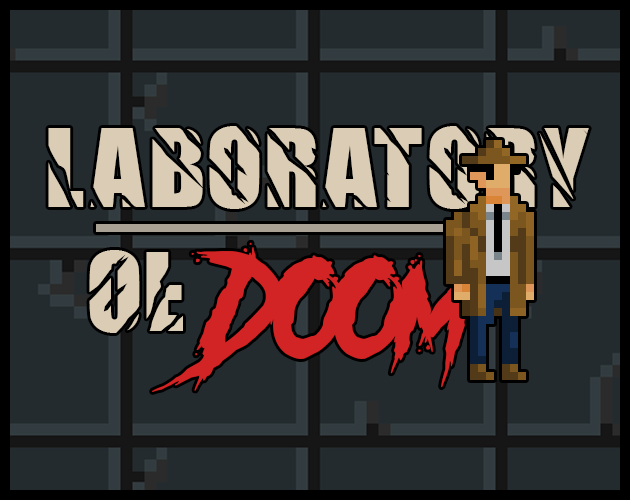

# LABORATORY OF DOOM (Post-jam Version)

  

## NOTE
This repository is being __ARCHIVED__ by the owner on August 20th, 2024.

## OVERVIEW
This was originally an entry for __Ludum Dare 54__ on _Septemper 29th, 2023_.  
__THEME: LIMITED SPACE__

But since the submission deadline has ended, this is the __post-jam version__ with bonus content, additional features, and more polished/optimized gameplay.

You can find the original jam version at the `jam-original` branch.

## DESCRIPTION
You’re a __private detective__ who gets to investigate about an __unknown substance__ being experimented on humans that turned them into __atrocious monsters__. Because of the urge to find the truth behind all of this and bring it to the light, you went to an __abandoned laboratory__ in which the evidences led to. But little that you know, what’s __lurking behind the darkness__ is far more the you could imagine.

## LINKS
Check out the jam submission [__here__](https://ldjam.com/events/ludum-dare/54/laboratory-of-doom). Or play both versions directly [__here__](https://constance012.itch.io/laboratory-of-doom).

## INGAME CAPTURES

© 2023-2024 CST Games.